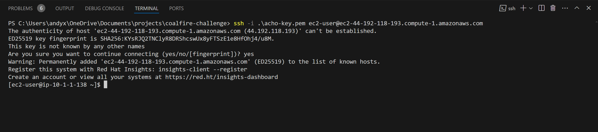
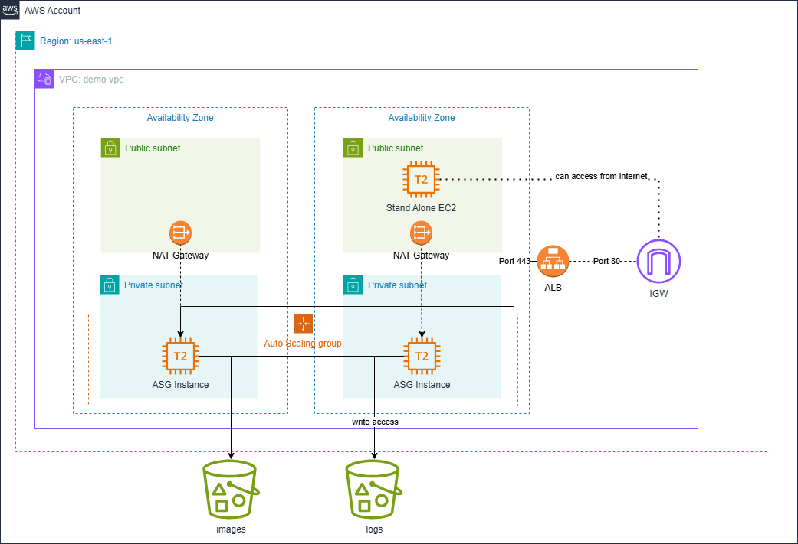

# AWS Technical Challenge

## Description

### Scenario

A company is looking to create a proof-of-concept environment in AWS. They want a simple VPC as outlined below. The company would also like to use Terraform to manage their infrastructure via code.

### Note

When running the code, make sure to update the tfvars and generate an EC2 key pair and place the pem key in this directory. Add the pem file to the tfvars file. To match the example tfvars file, run the following command in the terminal while in this directory:

`aws ec2 create-key-pair --profile sandbox --region us-east-2 --key-type rsa --key-format pem --query "KeyMaterial" --key-name "ec2-module-test" --output text > ec2-module-test.pem`

Note that `terraform destroy` will NOT remove the key pair from the AWS account as it is not tracked by state.

### Screenshot

### Diagram

<!-- BEGIN_TF_DOCS -->
## Requirements

| Name | Version |
|------|---------|
|  [terraform](#requirement\_terraform) | ~> 1.0 |
|  [aws](#requirement\_aws) | ~> 5.30 |

## Providers

| Name | Version |
|------|---------|
|  [aws](#provider\_aws) | 5.58.0 |
|  [local](#provider\_local) | 2.5.1 |
|  [random](#provider\_random) | 3.6.2 |

## Modules

| Name | Source | Version |
|------|--------|---------|
|  [asg](#module\_asg) | terraform-aws-modules/autoscaling/aws | n/a |
|  [asg\_sg](#module\_asg\_sg) | terraform-aws-modules/security-group/aws | ~> 5.0 |
|  [ec2](#module\_ec2) | terraform-aws-modules/ec2-instance/aws | n/a |
|  [ec2\_sg](#module\_ec2\_sg) | terraform-aws-modules/security-group/aws | ~> 5.0 |
|  [images\_s3\_bucket](#module\_images\_s3\_bucket) | terraform-aws-modules/s3-bucket/aws | n/a |
|  [log\_bucket](#module\_log\_bucket) | terraform-aws-modules/s3-bucket/aws | n/a |
|  [vpc](#module\_vpc) | terraform-aws-modules/vpc/aws | ~> 5.0 |

## Resources

| Name | Type |
|------|------|
| [aws_iam_instance_profile.ec2_ssm_instance_profile](https://registry.terraform.io/providers/hashicorp/aws/latest/docs/resources/iam_instance_profile) | resource |
| [aws_iam_policy.s3_read_policy](https://registry.terraform.io/providers/hashicorp/aws/latest/docs/resources/iam_policy) | resource |
| [aws_iam_policy.s3_write_policy](https://registry.terraform.io/providers/hashicorp/aws/latest/docs/resources/iam_policy) | resource |
| [aws_iam_role.ec2_ssm_role](https://registry.terraform.io/providers/hashicorp/aws/latest/docs/resources/iam_role) | resource |
| [aws_iam_role.this](https://registry.terraform.io/providers/hashicorp/aws/latest/docs/resources/iam_role) | resource |
| [aws_iam_role_policy_attachment.ec2_log_policy_attachment](https://registry.terraform.io/providers/hashicorp/aws/latest/docs/resources/iam_role_policy_attachment) | resource |
| [aws_iam_role_policy_attachment.ec2_ssm_policy_attachment](https://registry.terraform.io/providers/hashicorp/aws/latest/docs/resources/iam_role_policy_attachment) | resource |
| [aws_kms_key.objects](https://registry.terraform.io/providers/hashicorp/aws/latest/docs/resources/kms_key) | resource |
| [aws_lb.asg_lb](https://registry.terraform.io/providers/hashicorp/aws/latest/docs/resources/lb) | resource |
| [aws_lb_listener.http](https://registry.terraform.io/providers/hashicorp/aws/latest/docs/resources/lb_listener) | resource |
| [aws_lb_listener.https](https://registry.terraform.io/providers/hashicorp/aws/latest/docs/resources/lb_listener) | resource |
| [aws_lb_target_group.asg_tg](https://registry.terraform.io/providers/hashicorp/aws/latest/docs/resources/lb_target_group) | resource |
| [aws_s3_object.active](https://registry.terraform.io/providers/hashicorp/aws/latest/docs/resources/s3_object) | resource |
| [aws_s3_object.archive](https://registry.terraform.io/providers/hashicorp/aws/latest/docs/resources/s3_object) | resource |
| [aws_s3_object.inactive](https://registry.terraform.io/providers/hashicorp/aws/latest/docs/resources/s3_object) | resource |
| [aws_s3_object.memes](https://registry.terraform.io/providers/hashicorp/aws/latest/docs/resources/s3_object) | resource |
| [aws_security_group.alb_sg](https://registry.terraform.io/providers/hashicorp/aws/latest/docs/resources/security_group) | resource |
| [random_id.this](https://registry.terraform.io/providers/hashicorp/random/latest/docs/resources/id) | resource |
| [aws_ami.redhat_ami](https://registry.terraform.io/providers/hashicorp/aws/latest/docs/data-sources/ami) | data source |
| [aws_availability_zones.available](https://registry.terraform.io/providers/hashicorp/aws/latest/docs/data-sources/availability_zones) | data source |
| [aws_caller_identity.current](https://registry.terraform.io/providers/hashicorp/aws/latest/docs/data-sources/caller_identity) | data source |
| [aws_iam_policy_document.bucket_policy](https://registry.terraform.io/providers/hashicorp/aws/latest/docs/data-sources/iam_policy_document) | data source |
| [aws_iam_policy_document.s3_read_policy](https://registry.terraform.io/providers/hashicorp/aws/latest/docs/data-sources/iam_policy_document) | data source |
| [aws_iam_policy_document.s3_write_policy](https://registry.terraform.io/providers/hashicorp/aws/latest/docs/data-sources/iam_policy_document) | data source |
| [local_file.key](https://registry.terraform.io/providers/hashicorp/local/latest/docs/data-sources/file) | data source |

## Inputs

| Name | Description | Type | Default | Required |
|------|-------------|------|---------|:--------:|
|  [aws\_region](#input\_aws\_region) | The region where things will be deployed by default | `string` | `"us-east-1"` | no |
|  [azs](#input\_azs) | List of Availability Zones | `list(string)` | n/a | yes |
|  [certificate\_arn](#input\_certificate\_arn) | Certificate arn | `string` | n/a | yes |
|  [key\_name](#input\_key\_name) | The name of the EC2 pem key in this directory (without the suffix) | `string` | n/a | yes |
|  [myip](#input\_myip) | Personal IP address (ex: x.x.x.x/32) | `string` | n/a | yes |
|  [private\_subnets](#input\_private\_subnets) | List for the private subnets | `list(string)` | n/a | yes |
|  [public\_subnets](#input\_public\_subnets) | List for the public subnets | `list(string)` | n/a | yes |
|  [vpc\_cidr](#input\_vpc\_cidr) | The cidr block for the vpc created for testing the security group | `string` | n/a | yes |

## Outputs

No outputs.
<!-- END_TF_DOCS -->